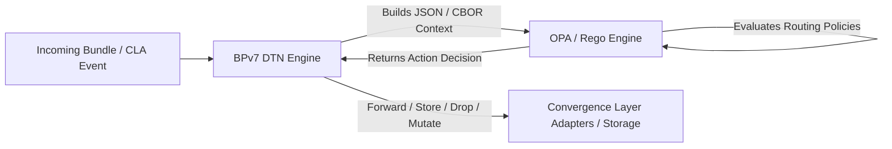

# DTN Mesh Algorithm: Transposing Mesh & Opportunistic Routing Algorithms to DTN (BPv7)

This research and experimentation project aims to explore the transposition, adaptation, and unification of routing algorithms from diverse domains (ad-hoc mesh networks, tactical networks, amateur radio, LPWAN/IoT protocols, and academic DTN literature) within the **DTN (Delay/Disruption Tolerant Networking)** architecture based on the **Bundle Protocol version 7 ([RFC 9171](https://www.rfc-editor.org/rfc/rfc9171.html))**.

The project serves as a foundation for theoretical insights, block extension specifications ([BUNDLE-BLOCK-TYPE.md](./BUNDLE-BLOCK-TYPE.md)), routing policy modeling via **Open Policy Agent (OPA / Rego)**, as well as a series of technical blog posts and reference implementations.

---

## 1. Project Objectives

1. **Map and analyze heterogeneous routing algorithms:**
   - Identify fundamental paradigms: managed flooding, distance vector, link-state, opportunistic/probabilistic routing, scheduled contact routing, source routing, and geographic routing.
   - Analyze how these approaches handle link disruptions, buffer management, energy constraints, and limited bandwidth.

2. **Transpose these protocols to Bundle Protocol v7 (BPv7):**
   - Map specific protocol primitives onto standard and experimental BPv7 blocks.
   - Design and specify new **Bundle Block Types** (IANA experimental range `192–255`) to encapsulate required routing metadata (e.g., replication quotas, WIDE-n-N future paths, predictability metrics, geographic coordinates).

3. **Evaluate and implement policy-driven routing with OPA (Open Policy Agent):**
   - Decouple the DTN transport engine (handling CLAs, storage, and CBOR encapsulation) from the forwarding decision logic (*forwarding engine*).
   - Formalize routing rules as declarative **Rego** rules fed by structured contexts (bundle status, local topology, radio metrics, CLA neighborhood).

4. **Disseminate results:**
   - Write technical articles detailing mathematical/conceptual modeling, block CBOR formatting, and implementation POCs.

---

## 2. Protocols Under Study

### A. Initially Proposed Protocols

| Protocol | Domain of Origin | Main Paradigm | Key Features |
| :--- | :--- | :--- | :--- |
| **Spray and Wait** | DTN Literature (Spyropoulos et al.) | Opportunistic / Quota-based | *Spray* phase (controlled distribution of $L$ copies, standard or binary) followed by *Wait* phase (direct delivery by carriers). |
| **PRoPHET** | RFC 6693 (DTNRG) | Probabilistic / History-based | Computation of a probabilistic delivery metric based on contact history, aging, and transitivity. |
| **HYMAD** | Hybrid DTN-MANET Networks | Multi-tier Hybrid | Partitioning into local MANET groups and DTN routing (e.g., Spray and Wait) between disjoint groups. |
| **AREDN (Legacy: OLSRv1)** | Amateur Radio / Mesh Wi-Fi | Proactive / Link-State | Periodic link-state dissemination optimized by Multi-Point Relays (MPR). |
| **AREDN (Modern: Babel)** | Amateur Radio / Mesh | Distance-Vector / Mixed Metrics | Loop-free Bellman-Ford algorithm ([RFC 8966](https://www.rfc-editor.org/rfc/rfc8966.html)), handling diverse metrics (ETX, RTT, radio). |
| **Reticulum** | Resilient Network / Cryptographic | Distance-Vector / Announcements | 16-byte cryptographic hash addressing, propagation of destination announcements (*Next Hop*), routing without central infrastructure. |
| **Meshtastic** | Citizen LoRa Mesh Network | Managed Flooding | Packet hash deduplication, hop limit decrement, rebroadcast delay weighted by SNR/channel. |
| **APRS (Digipeating AX.25)** | Amateur Radio | Source Routing & Aliasing | Managed flooding with forwarding alias consumption (`WIDE1-1`, `WIDE2-2`), traversal node tracing, and immediate loop suppression. |

---

### B. Complementary Recommended Protocols

To provide a comprehensive overview of routing architectures applicable to DTN, the following protocols complement the study:

| Protocol | Domain of Origin | Main Paradigm | Why Include It? |
| :--- | :--- | :--- | :--- |
| **Epidemic Routing** | Foundational DTN Literature (Vahdat & Becker) | Full Flooding | Serves as an upper bound benchmark for delivery ratio and reference for testing storage/buffer saturation limits. |
| **Contact Graph Routing (CGR / SABR)** | Space / CCSDS 734.3-B-1 | Scheduled Deterministic | De facto standard for space DTN (NASA/ESA). Allows comparing purely opportunistic approaches with contact plan-based approaches. |
| **MaxProp** | Vehicular DTN Networks (Burgess et al.) | Probabilistic + Buffer Prioritization | Highly effective under tight memory constraints. Prioritizes bundles based on remaining path probability, age, and hop count, with exchange of cleared delivery lists. |
| **B.A.T.M.A.N. (batman-adv)** | Community Mesh Networks (Freifunk) | Distributed L2 Distance-Vector | Originator message (OGM) detection to compute link quality to each node without maintaining global topology. |
| **Geographic / Geocast DTN (e.g., GeoDTN, GPSR-DTN)** | Sensor Networks / Mobile Ad-hoc | Geographic / Position-based | Routing decision based on relative GPS coordinates of source, carrier, and target region (e.g., search and rescue, emergency). |
| **Briar (Bramble Transport)** | Peer-to-Peer Secure Messaging / Offline | Graph Sync / Local Epidemic | Routing and synchronization of encrypted data hop-by-hop via Bluetooth, local Wi-Fi, and Tor using transport-agnostic delivery. |
| **Disaster Radio (Disaster Mesh)** | Emergency Relief Networks | Lightweight LoRa Flooding | Ultra-lightweight protocol for low-memory microcontrollers, designed for extreme resilience during natural disasters. |

---

## 3. Bundle Block Types to Leverage and Design

To implement these behaviors while remaining fully compliant with **BPv7 ([RFC 9171](https://www.rfc-editor.org/rfc/rfc9171.html))**, we combine standardized blocks with new experimental extension blocks.

See the detailed state of the art for blocks in the document: **[BUNDLE-BLOCK-TYPE.md](./BUNDLE-BLOCK-TYPE.md)**.

```
+-----------------------------------------------------------------------+
|                             PRIMARY BLOCK                             |
|       (Source EID, Destination EID, Lifetime, Creation Timestamp)     |
+-----------------------------------------------------------------------+
|  [Standard] Hop Count Block (Type 10) / Bundle Age Block (Type 7)     |
+-----------------------------------------------------------------------+
|  [IETF Draft] Traceroute Block (TREB) -> History of past hops        |
+-----------------------------------------------------------------------+
|  [Proposed New Block] Route & Path Control Block                     |
|   -> APRS Future Path (WIDE-n-N), Source Route, Quota Spray & Wait    |
+-----------------------------------------------------------------------+
|                         BUNDLE PAYLOAD BLOCK                          |
+-----------------------------------------------------------------------+
```

### A. Standard BPv7 Blocks and IETF Drafts to Leverage

1. **Hop Count Block (Type 10 - RFC 9171):**
   - Loop prevention and radius control (analogous to TTL/Hop Limit in Meshtastic, Reticulum, AX.25).
2. **Previous Node Insertion Block (Type 6 - RFC 9171):**
   - Immediate identification of the proximate sender to prevent echoing the bundle back (*split horizon* / immediate deduplication).
3. **Bundle Age Block (Type 7 - RFC 9171):**
   - Crucial for nodes without real-time clock (RTC) synchronized via GPS/NTP (very common in LoRa microcontrollers or tactical networks).
4. **Traceroute Extension Block (TREB - IETF Draft):**
   - Chronological recording of the traveled path, dwell time at each node, and observed link metrics (replaces ad-hoc APRS tracing).

---

### B. Generic Modular Extension Block ([mesh-algo-extension-block.cddl](./mesh-algo-extension-block.cddl))

Rather than freezing rigid formats per protocol, we designed a **unified mesh routing extension block (Type 200)** based on **orthogonal facets and dimensions**. Any present or future protocol can enable and compose a subset of these CBOR primitives:

| Wire Format Facet | Role & On-the-wire CBOR Content | Protocols / Use Cases |
| :--- | :--- | :--- |
| **`legacy_bridge_id`** | Optional external identifier (bytes or integer). | Gateways to non-DTN networks (LoRa, AX.25). In native DTN, the canonical **Bundle ID** `(source, time, seq)` suffices. |
| **`replication_control`** | Allocated copy quota $L$ (`quota`), replication mode (`mode`: source or binary $L/2$), and active phase (`phase`: SPRAY or WAIT). | Strict replica budgeting: Spray & Wait, HYMAD, MaxProp. |
| **`trajectory_control`** | Vector of ordered future hops (`path_elements`), active index (`active_hop_index`), strict waypoints (`strict_target`) or scoped alias waypoints (`scoped_alias`). | Source routing, APRS digipeating (WIDE n-N), explicit paths. Complementary to the **Traceroute Extension Block (TREB)** which records the past. |
| **`opportunistic_threshold`** | Minimum required utility threshold (`float`). | Probabilistic opportunistic routing: PRoPHET, MaxProp, EBR. |
| **`spatial_scope`** | Geographic center (lat, lon, altitude) and action radius (`radius_meters`). | Geocast, Search & Rescue, geographic routing (GeoDTN, GPSR). |

> **The Meshtastic Case Study (Zero custom wire block):**  
> Meshtastic's managed flooding requires zero proprietary block on the wire. Hop control relies on the standard BPv7 **Hop Count Block (Type 10)**, deduplication on the **canonical Bundle ID**, channel segregation on **EID whitelists**, and $Backoff(SNR)$ delay computation as well as overheard cancellation are governed locally by OPA using telemetry (`input.ingress.snr_db`, `input.node.cancelled_rebroadcasts`).

> **On-the-wire vs OPA Evaluation Context Separation:**  
> Local physical metrics (measured radio SNR, RSSI in dBm, backoff delay calculation in ms, buffer memory status) **are never serialized on the radio wire** to conserve bandwidth. They are injected directly into OPA's evaluation environment (`input.ingress`, `input.contact`, `input.node`), also formalised in Part 2 of [mesh-algo-extension-block.cddl](./mesh-algo-extension-block.cddl).

---

## 4. Modeling and Decision Making via Open Policy Agent (OPA)

A central aspect of this project is formalizing DTN routing decisions into declarative rules using **OPA (Open Policy Agent)** written in **Rego**.

### A. Decoupled Architecture: OPA / DTN Engine



### B. Required Input Information for OPA (`input`)

To make a forwarding decision, OPA receives a complete JSON projection:

1. **Bundle attributes (`input.bundle`):**
   - Primary Block: source, destination, flags (custody, singleton), lifetime, creation timestamp.
   - Extension Blocks: hop count, relative age, past traceroute, replication quota, future path (APRS / source route).
   - Bundle size and Class of Service (QoS) priority.
2. **Local node state (`input.node`):**
   - Local node EID, current GPS coordinates.
   - Remaining storage capacity and buffer occupancy state.
   - Battery level and energy constraints.
3. **Neighbor table and convergence layers (`input.neighbors`):**
   - Currently connected / reachable neighbors via CLAs (TCP, UDP, LoRa, Bluetooth, AX.25).
   - Link metrics: SNR, RSSI, loss rate, available bandwidth.
   - Historical data: contact probability matrix (e.g., PRoPHET table), last contact time.
4. **Local operational policy (`data.policies`):**
   - Authorized roles (e.g., does node accept acting as APRS digipeater? Spray & Wait relay?).
   - Global flooding quotas and EID blacklists / whitelists.

### C. Actions Returned by OPA (`output`)

Evaluation of the Rego policy produces a set of direct actions for the DTN engine:
- `action`: `"FORWARD"`, `"STORE_AND_FORWARD"`, `"DROP"`, `"DELIVER_LOCAL"`.
- `forward_targets`: List of `(neighbor_eid, cla_interface)` pairs.
- `mutations`: Modifications to apply to bundle blocks prior to transmission:
  - Decrement `hop_count`.
  - Update quota $L$ in the `Replication Quota Block`.
  - Update hop pointer in the `Digipeat Block`.
  - Append local EID into the `Traceroute Block`.
- `drop_reason`: Rejection code if packet is dropped (for potential Status Report issuance).

---

## 5. Roadmap and Deliverables

1. **Technical articles & case studies:**
   - [Article 0 — Foundations of DTN Routing with Open Policy Agent](./article-0-intro.en.md) (BPv7 Architecture, standard Type 10 & 7 blocks, deduplication, status reports, and DoS defense `blacklist_sources`).
   - [Article 1 — Transposing APRS Digipeating (AX.25 WIDE n-N) to DTN (BPv7)](./article-1-aprs.en.md) (Source routing, alias consumption, Dire Wolf compliance).
   - [Article 2 — Taming Flooding in DTN: From Epidemic to Spray and Wait and Meshtastic Managed Flooding](./article-2-flood.en.md) (Strict quotas, LoRa SNR backoff, zero custom wire block proof for Meshtastic).
   - [Article 3 — Opportunistic Routing and Encounter History: PRoPHET (RFC 6693) under Open Policy Agent](./article-3-prophet.en.md) (Differential math of predictability, inter-node signaling, buffer eviction).
   - [Article 4 — Probabilistic Routing and Buffer Management under Constraints: MaxProp and Theoretical Optimizations (HP-MaxProp)](./article-4-maxprop.en.md) (Logarithmic cost of information, smooth hop penalty, 2-hop local gossip, and Cleared List purge).
   - [Article 5 — Hybrid Routing, Distance-Vector, and Cryptographic Addressing: Reticulum (RNS) Transposed to DTN](./article-5-reticulum.en.md) (16-byte cryptographic addressing, signed path announcements, zero data wire block, and Store-Carry-and-Forward persistence).
   - [Article 6 — Proactive Mesh Networks and MANET-DTN Hybridization: AREDN, Babel (RFC 8966), and HYMAD Architecture under Open Policy Agent](./article-6-babel-aredn.en.md) (Loop-free Bellman-Ford routing, feasibility distance, ETX radio metrics, and fallback to inter-island DTN carriers).
   - [Article 7 — Deterministic Contact Graph Routing: Contact Graph Routing (CGR / SABR - CCSDS 734.3-B-1) under Open Policy Agent](./article-7-cgr.en.md) (Orbital and deep-space networks, deterministic contact plan, Time-Expanded Dijkstra, EDT, and early drop on lifetime expiration).
   - [Article 8 — Geographic Routing and Geocasting in DTN: GeoDTN and Greedy-Carry-and-Forward under Open Policy Agent](./article-8-geodtn.en.md) (Greedy MFR progression, void handling via Store-Carry-and-Forward, Geocasting bounded by `spatial_scope` facet).
   - [Article 9 — Architectural Synthesis: Policy-Driven DTN Routing with OPA, Modular Extension Block, and Control Plane Unification](./article-9-synthese-architecture.en.md) (OPA/DTN engine decoupling, control message reconciliation, essential native Rego builtins, field/research impacts, and IETF/NASA alignment with ION SNW, bp-sand, ECOS, and BPQ).

2. **Formal specifications (CDDL):**
   - [mesh-algo-extension-block.cddl](./mesh-algo-extension-block.cddl): Generic wire format for the mesh routing block (Type 200) and complete OPA evaluation context schema.
   - [prophet.cddl](./prophet.cddl): PRoPHET inter-node control messages (HELLO, RIB Update, Summary Vector, combined Handshake, and Delivery ACK).
   - [maxprop.cddl](./maxprop.cddl): MaxProp inter-node control messages (direct probabilities vector, Cleared List acknowledgments) and sorting/eviction metadata.
   - [reticulum.cddl](./reticulum.cddl): Reticulum inter-node control messages (Announce, Path Request, Path Response, Proof) and local routing table structure.
   - [babel.cddl](./babel.cddl): Babel inter-node control messages (Hello, IHU, Update, Route Request, Seqno Request) and proactive routing table with Feasible Distance.
   - [cgr.cddl](./cgr.cddl): CGR dynamic contact plan specifications (Contact Plan Update, Revoke, Range Update) and computed routes.

3. **Code & OPA Declarative Policies:**
   - Modular Rego rules in [policies/](./policies/) organized by protocol (`aprs/`, `flood/`, `prophet/`, `maxprop/`, `reticulum/`, `babel/`, `cgr/`, `geodtn/`).
   - Suite of 140 automated unit tests (`opa test ./policies -v` -> 140/140 PASS).
