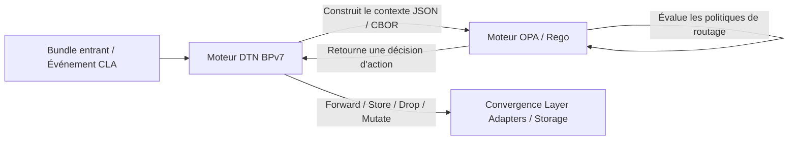

# DTN Mesh Algorithm: Transposition d'algorithmes de routage mesh & opportunistes vers DTN (BPv7)

Ce projet de recherche et d'expérimentation vise à explorer la transposition, l'adaptation et l'unification d'algorithmes de routage issus de divers horizons (réseaux maillés ad-hoc, réseaux tactiques, radioamateurs, protocoles LPWAN/IoT et littérature DTN académique) au sein de l'architecture **DTN (Delay/Disruption Tolerant Networking)** basée sur le **Bundle Protocol version 7 ([RFC 9171](https://www.rfc-editor.org/rfc/rfc9171.html))**.

Le projet sert de socle pour des réflexions théoriques, des spécifications d'extensions de blocs ([BUNDLE-BLOCK-TYPE.md](file:///home/loic/projets/dtn-mesh-algorithm/BUNDLE-BLOCK-TYPE.md)), des modélisations de politiques de routage via **Open Policy Agent (OPA / Rego)**, ainsi qu'une série d'articles de blog techniques et d'implémentations de référence.

---

## 1. Objectifs du projet

1. **Cartographier et analyser les algorithmes de routage hétérogènes :**
   - Identifier les paradigmes fondamentaux : inondation contrôlée (*flooding*), vecteur de distance, état de liens, routage opportuniste/probabiliste, routage par contact programmé, routage à la source et routage géographique.
   - Analyser comment ces approches gèrent les ruptures de liens, la mémoire tampon (*buffer management*), l'énergie et la bande passante contrainte.

2. **Transposer ces protocoles sur le Bundle Protocol v7 (BPv7) :**
   - Mapper les primitives protocolaires spécifiques sur les blocs standards et expérimentaux de BPv7.
   - Concevoir et spécifier de nouveaux **Bundle Block Types** (plage expérimentale IANA `192–255`) pour encapsuler les métadonnées de routage requises (ex: quotas de réplication, chemins futurs WIDE-n-N, métriques de prédictibilité, coordonnées géographiques).

3. **Évaluer et implémenter le routage piloté par politiques avec OPA (Open Policy Agent) :**
   - Découpler le moteur de transport DTN (gestion des CLA, du stockage et de l'encapsulation CBOR) de la logique de décision d'acheminement (*forwarding engine*).
   - Formaliser les règles de routage sous forme de règles déclaratives **Rego** alimentées par des contextes structurés (état du bundle, topologie locale, métriques radio, voisinage CLA).

4. **Diffuser les résultats :**
   - Rédiger des articles de blog détaillant la modélisation mathématique/conceptuelle, le format CBOR des blocs et des démonstrateurs d'implémentation.

---

## 2. Protocoles à l'étude

### A. Protocoles proposés initialement

| Protocole | Domaine d'origine | Paradigme principal | Caractéristiques clés |
| :--- | :--- | :--- | :--- |
| **Spray and Wait** | Littérature DTN (Spyropoulos et al.) | Opportuniste / Quota-based | Phase *Spray* (distribution contrôlée de $L$ copies, normal ou binaire) puis phase *Wait* (livraison directe par les porteurs). |
| **PRoPHET** | RFC 6693 (DTNRG) | Probabiliste / Historique | Calcul d'une métrique d'acheminement probabiliste basée sur l'historique des rencontres, le vieillissement (*aging*) et la transitivité. |
| **HYMAD** | Réseaux hybrides DTN-MANET | Hybride multi-niveaux | Découpage en groupes MANET locaux et routage DTN (ex: Spray and Wait) entre groupes disjoints. |
| **AREDN (Ancien : OLSRv1)** | Radioamateur / Mesh Wi-Fi | Proactif / État de liens | Diffusion périodique d'états de liens optimisée par des relais multipoints (MPR - *Multi-Point Relays*). |
| **AREDN (Nouveau : Babel)** | Radioamateur / Mesh | Vecteur de distance / Métriques mixtes | Algorithme Bellman-Ford sans boucle ([RFC 8966](https://www.rfc-editor.org/rfc/rfc8966.html)), gestion de métriques diverses (ETX, RTT, radio). |
| **Reticulum** | Réseau résilient / Cryptographique | Vecteur de distance / Annonces | Adressage par hash cryptographique (16 octets), propagation d'annonces de destination (*Next Hop*), routage sans infrastructure centrale. |
| **Meshtastic** | Réseau LoRa mesh citoyen | Inondation gérée (*Managed Flooding*) | Déduplication par hash de paquet, décrément de hop-limit, temporisation de rediffusion pondérée par le SNR/canal. |
| **APRS (Digipeating AX.25)** | Radioamateur | Routage à la source & Alias | Inondation contrôlée avec consommation d'alias d'acheminement (`WIDE1-1`, `WIDE2-2`), traçabilité des nœuds traversés et suppression des boucles immédiates. |

---

### B. Protocoles recommandés en complément

Afin d'obtenir une vision exhaustive des architectures de routage applicables au DTN, les protocoles suivants enrichissent l'étude :

| Protocole | Domaine d'origine | Paradigme principal | Pourquoi l'intégrer ? |
| :--- | :--- | :--- | :--- |
| **Epidemic Routing** | Littérature DTN fondatrice (Vahdat & Becker) | Inondation aveugle (*Full flooding*) | Sert d'étalon supérieur (*upper bound*) en taux de livraison et de référence pour tester les limites de saturation de stockage/buffer. |
| **Contact Graph Routing (CGR / SABR)** | Spatial / [RFC 8877](https://www.rfc-editor.org/rfc/rfc8877.html) | Déterministe planifié | Le standard de facto du DTN spatial (NASA/ESA). Permet de comparer les approches purement opportunistes aux approches basées sur un calendrier de contacts (*contact plan*). |
| **MaxProp** | Réseaux véhiculaires DTN (Burgess et al.) | Probabiliste + Priorisation de buffer | Très efficace sous forte contrainte de mémoire. Priorise les bundles selon la probabilité de chemin restant, l'âge et le saut, avec échange de listes de paquets déjà livrés. |
| **B.A.T.M.A.N. (batman-adv)** | Réseaux maillés communautaires (Freifunk) | Vecteur de distance L2 distribué | Détection d'originator (OGM) pour calculer la qualité des liens vers chaque nœud sans maintenir la topologie globale. |
| **Geographic / Geocast DTN (ex: GeoDTN, GPSR-DTN)** | Réseaux de capteurs / Ad-hoc mobiles | Géographique / Position | Décision de routage basée sur les coordonnées GPS relatives du nœud émetteur, du porteur et de la zone cible (ex: secours, urgence). |
| **Briar (Bramble Transport)** | Messagerie sécurisée P2P / Hors-ligne | Synchronisation de graphe / Epidemic local | Routage et synchronisation de données chiffrées de proche en proche via Bluetooth, Wi-Fi local et Tor, avec transport agnostique. |
| **Disaster Radio (Disaster Mesh)** | Réseau de secours d'urgence | Inondation LoRa allégée | Protocole ultra-léger pour microcontrôleurs à faible mémoire, orienté résilience extrême lors de catastrophes naturelles. |

---

## 3. Bundle Block Types à exploiter et à concevoir

Pour implémenter ces comportements dans le respect de la spécification **BPv7 ([RFC 9171](https://www.rfc-editor.org/rfc/rfc9171.html))**, nous croisons les blocs standardisés avec de nouveaux blocs d'extension expérimentaux.

Consulter l'état de l'art détaillé des blocs dans le document : **[BUNDLE-BLOCK-TYPE.md](file:///home/loic/projets/dtn-mesh-algorithm/BUNDLE-BLOCK-TYPE.md)**.

```
+-----------------------------------------------------------------------+
|                             PRIMARY BLOCK                             |
|       (Source EID, Destination EID, Lifetime, Creation Timestamp)     |
+-----------------------------------------------------------------------+
|  [Standard] Hop Count Block (Type 10) / Bundle Age Block (Type 7)     |
+-----------------------------------------------------------------------+
|  [IETF Draft] Traceroute Block (TREB) -> Historique des sauts passés  |
+-----------------------------------------------------------------------+
|  [Nouveau Bloc Proposé] Route & Path Control Block                    |
|   -> APRS Future Path (WIDE-n-N), Source Route, Quota Spray & Wait    |
+-----------------------------------------------------------------------+
|                         BUNDLE PAYLOAD BLOCK                          |
+-----------------------------------------------------------------------+
```

### A. Blocs BPv7 standards et brouillons IETF à mobiliser

1. **Hop Count Block (Type 10 - RFC 9171) :**
   - Prévention des boucles et contrôle du rayon de diffusion (analogue au TTL/Hop Limit de Meshtastic, Reticulum, AX.25).
2. **Previous Node Insertion Block (Type 6 - RFC 9171) :**
   - Identification immédiate du nœud amont (*proximate sender*) pour éviter de lui renvoyer le bundle en echo (*split horizon* / déduplication immédiate).
3. **Bundle Age Block (Type 7 - RFC 9171) :**
   - Crucial pour les nœuds sans horloge temps réel (RTC) synchronisée par GPS/NTP (très fréquent en microcontrôleurs LoRa ou réseau tactique).
4. **Traceroute Extension Block (TREB - IETF Draft) :**
   - Enregistrement chronologique du chemin parcouru, temps de séjour sur chaque nœud et métriques de liaison observées (remplace le traçage ad-hoc d'APRS).

---

### B. Le Bloc d'Extension Générique Modulaire ([mesh-algo-extension-block.cddl](file:///home/loic/projets/dtn-mesh-algorithm/mesh-algo-extension-block.cddl))

Plutôt que de figer des formats rigides par protocole, nous avons conçu un **bloc d'extension de routage mesh unifié (Type 200)** fondé sur des **facettes et dimensions orthogonales**. N'importe quel protocole présent ou futur peut activer et composer un sous-ensemble de ces primitives CBOR :

| Facette filaire (Wire Format) | Rôle & Contenu CBOR sur le câble | Protocoles / Usages |
| :--- | :--- | :--- |
| **`legacy_bridge_id`** | Identifiant externe optionnel (bytes ou entier). | Passerelles vers réseaux non-DTN (LoRa, AX.25). En DTN natif, le **Bundle ID canonique** `(source, time, seq)` suffit. |
| **`replication_control`** | Quota $L$ de copies allouées (`quota`), mode de réplication (`mode`: source ou binaire $L/2$), et phase active (`phase`: SPRAY ou WAIT). | Contingentement strict de répliques : Spray & Wait, HYMAD, MaxProp. |
| **`trajectory_control`** | Vecteur de sauts futurs ordonnés (`path_elements`), index actif (`active_hop_index`), étapes strictes (`strict_target`) ou étapes à portée générique (`scoped_alias`). | Routage à la source, digipeating APRS (WIDE n-N), chemins explicites. Complémentaire au **Traceroute Extension Block (TREB)** qui consigne le passé. |
| **`opportunistic_threshold`** | Seuil d'utilité minimal requis (`float`). | Routage opportuniste probabiliste : PRoPHET, MaxProp, EBR. |
| **`spatial_scope`** | Centre géographique (lat, lon, altitude) et rayon d'action (`radius_meters`). | Geocast, SAR secours, routage géographique (GeoDTN, GPSR). |

> **Le cas d'école de Meshtastic (Zéro bloc filaire custom) :**  
> L'inondation gérée de Meshtastic ne nécessite aucun bloc propriétaire sur le câble. Le contrôle de sauts repose sur le **Hop Count Block (Type 10)** standard BPv7, la déduplication sur le **Bundle ID canonique**, la ségrégation de canal sur les **whitelists d'EID**, et le calcul de temporisation $Backoff(SNR)$ ainsi que l'annulation par écoute sont gouvernés localement par OPA via la télémétrie (`input.ingress.snr_db`, `input.node.cancelled_rebroadcasts`).

> **Séparation Filaire vs Contexte d'Évaluation OPA :**  
> Les métriques physiques locales (SNR radio mesuré, RSSI en dBm, calcul de temporisation de backoff en ms, état mémoire du buffer) **ne sont jamais sérialisées sur le câble radio** pour préserver la bande passante. Elles sont injectées directement dans l'environnement d'évaluation d'OPA (`input.ingress`, `input.contact`, `input.node`), également formalisé dans la Partie 2 de [mesh-algo-extension-block.cddl](file:///home/loic/projets/dtn-mesh-algorithm/mesh-algo-extension-block.cddl).

---

## 4. Modélisation et prise de décision via Open Policy Agent (OPA)

Une étape centrale de ce projet consiste à formaliser les décisions de routage DTN sous forme de règles déclaratives avec **OPA (Open Policy Agent)** en langage **Rego**.

### A. Architecture de découplage OPA / Moteur DTN



### B. Informations requises en entrée d'OPA (`input`)

Pour prendre une décision d'acheminement, OPA reçoit une projection JSON complète :

1. **Attributs du bundle (`input.bundle`) :**
   - Primary Block : source, destination, flags (custody, singleton), lifetime, création.
   - Extension Blocks : hop count, âge relatif, traceroute passé, quota de réplication, chemin futur (APRS / source route).
   - Taille du bundle et priorité de classe de service (QoS).
2. **État du nœud local (`input.node`) :**
   - EID du nœud local, coordonnées GPS actuelles.
   - Capacité de stockage restante et état de la mémoire tampon (*buffer occupancy*).
   - Niveau de batterie et contraintes énergétiques.
3. **Table des voisins et canaux de convergence (`input.neighbors`) :**
   - Voisins actuellement connectés / joignables via les CLA (TCP, UDP, LoRa, Bluetooth, AX.25).
   - Métriques de lien : SNR, RSSI, taux de perte, bande passante disponible.
   - Données historiques : matrice de probabilité de rencontre (ex: table PRoPHET), dernier contact.
4. **Politique opérationnelle locale (`data.policies`) :**
   - Rôles autorisés (ex: le nœud accepte-t-il d'être digipeater APRS ? relais SprayAndWait ?).
   - Quotas globaux d'inondation et listes noires / blanches d'EID.

### C. Actions retournées par OPA (`output`)

L'évaluation de la politique Rego produit un ensemble d'actions directes pour le moteur DTN :
- `action`: `"FORWARD"`, `"STORE_AND_FORWARD"`, `"DROP"`, `"DELIVER_LOCAL"`.
- `forward_targets`: Liste de couples `(neighbor_eid, cla_interface)`.
- `mutations`: Modifications à appliquer aux blocs du bundle avant transmission :
  - Décrémenter `hop_count`.
  - Mettre à jour le quota $L$ dans le `Replication Quota Block`.
  - Mettre à jour le pointeur de saut dans le `Digipeat Block`.
  - Ajouter l'EID local dans le `Traceroute Block`.
- `drop_reason`: Code de rejet si le paquet est abandonné (pour émission d'un Status Report éventuel).

---

## 5. Feuille de route et livrables

1. **Articles de vulgarisation & études de cas :**
   - *Article 1 :* De l'AX.25 d'APRS au Bundle Protocol v7 : réinventer le digipeating avec des blocs d'extension CBOR.
   - *Article 2 :* Inondation contrôlée et quotas : modéliser Meshtastic et SprayAndWait sur DTN.
   - *Article 3 :* Piloter un routeur DTN avec Open Policy Agent (OPA) : rendre le routage déclaratif.
   - *Article 4 :* Routage hybride et cryptographique : leçons de Reticulum et AREDN/Babel pour le DTN.
2. **Spécifications formelles (CDDL) :**
   - [mesh-algo-extension-block.cddl](file:///home/loic/projets/dtn-mesh-algorithm/mesh-algo-extension-block.cddl) : Format filaire générique du bloc de routage mesh (Type 200) et schéma de l'environnement d'évaluation OPA.
   - [prophet.cddl](file:///home/loic/projets/dtn-mesh-algorithm/prophet.cddl) : Messages de contrôle inter-nœuds PRoPHET (HELLO, RIB Update, Summary Vector, Handshake combiné et Delivery ACK).
3. **Code & Démonstrateurs :**
   - Règles Rego complètes pour chaque algorithme.
   - Banc de test émulé avec conteneurs ou simulateur DTN (ex: CORE / ns-3 / PyDTN).
