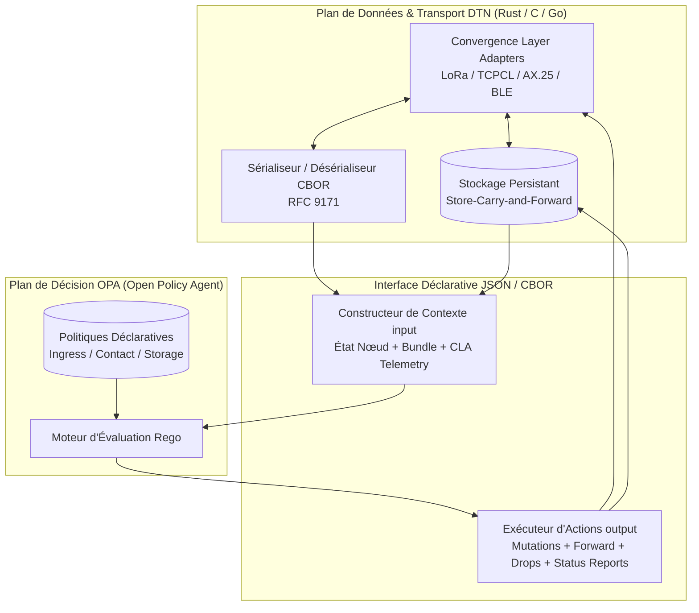
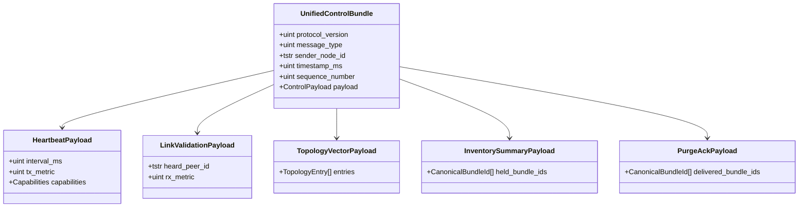
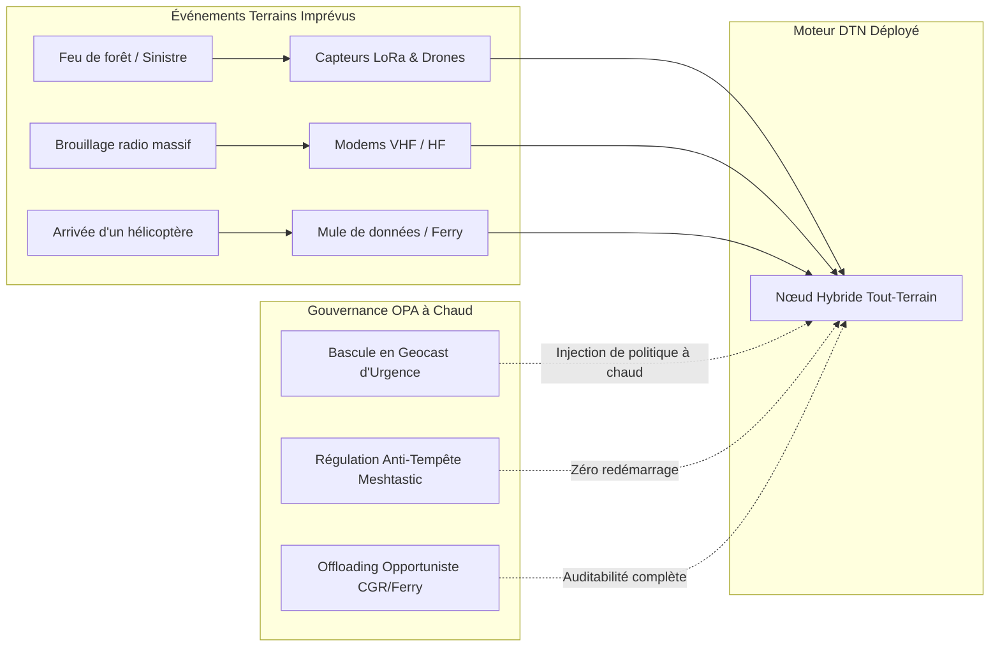

# Article 9 — Synthèse Architecturale : Routage DTN Piloté par Politiques OPA, Bloc d'Extension Modulaire et Unification du Plan de Contrôle

> **Auteurs :** Équipe de Recherche DTN & Systèmes Maillés Ad-Hoc  
> **Série technique :** Transposition des Algorithmes Mesh & Opportunistes vers le Bundle Protocol v7 (BPv7)  
> **Articles précédents :**  
> - [Article 0 — Les Fondations du Routage DTN avec Open Policy Agent](./article-0-intro.md)  
> - [Article 1 — Transposer le Digipeating APRS (AX.25 WIDE n-N) en DTN](./article-1-aprs.md)  
> - [Article 2 — Dompter l'Inondation en DTN : Spray and Wait et Meshtastic](./article-2-flood.md)  
> - [Article 3 — Routage Opportuniste et Historique des Rencontres : PRoPHET](./article-3-prophet.md)  
> - [Article 4 — Routage Probabiliste et Ordonnancement de Buffer : MaxProp & HP-MaxProp](./article-4-maxprop.md)  
> - [Article 5 — Routage Hybride, Vecteur de Distance et Adressage Cryptographique : Reticulum](./article-5-reticulum.md)  
> - [Article 6 — Réseaux Maillés Proactifs et Hybridation MANET-DTN : AREDN & Babel](./article-6-babel-aredn.md)  
> - [Article 7 — Routage Déterministe Spatial : Contact Graph Routing (CGR / SABR)](./article-7-cgr.md)  
> - [Article 8 — Routage Géographique et Geocasting en DTN : GeoDTN](./article-8-geodtn.md)  
> **Spécifications CDDL :** [mesh-algo-extension-block.cddl](./mesh-algo-extension-block.cddl), [prophet.cddl](./prophet.cddl), [maxprop.cddl](./maxprop.cddl), [reticulum.cddl](./reticulum.cddl), [babel.cddl](./babel.cddl), [cgr.cddl](./cgr.cddl)  
> **Code des politiques :** [policies/](./policies/) (140 tests unitaires OPA validés)

---

## 1. Introduction : La Convergence des Paradigmes de Routage

Au fil des huit premiers volets de cette série, nous avons exploré une gamme spectaculaire d'algorithmes de routage, allant des protocoles radioamateurs nés dans les années 1980 (APRS AX.25) jusqu'aux architectures résilientes modernes (Reticulum, Meshtastic) et aux standards de l'Internet interplanétaire (Contact Graph Routing - CCSDS 734.3-B-1 / SABR).

Chacun de ces algorithmes a été conçu à l'origine dans son propre écosystème en vase clos, avec ses formats de trames binaires propriétaires, ses métriques ad-hoc et ses hypothèses matérielles spécifiques.

Dans ce projet, nous avons poursuivi une double ambition :
1. **Démontrer l'universalité du Bundle Protocol version 7 ([RFC 9171](https://www.rfc-editor.org/rfc/rfc9171.html))** comme métamodèle commun capable d'encapsuler et d'unifier n'importe quelle sémantique de routage.
2. **Découpler intégralement la logique d'arbitrage du moteur de transport** grâce au langage déclaratif **Rego** et au moteur de politiques **Open Policy Agent (OPA)**.

Cet article conclusif dresse le bilan architectural de nos travaux, approfondit la conception du bloc modulaire Type 200 ([`mesh-algo-extension-block.cddl`](./mesh-algo-extension-block.cddl)), analyse la réconciliation possible des messages de contrôle, identifie les fonctions natives indispensables au moteur Rego, et examine la portée de cette approche pour les opérations de terrain, la recherche et l'alignement avec les travaux de standardisation en cours à l'IETF.

---

## 2. Le Découplage OPA / Moteur DTN et le Bloc Modulaire Type 200

### 2.1. L'Architecture de Découplage Total

L'architecture traditionnelle des démons DTN (comme ION, IBR-DTN, μPCN ou dtn7-rs) intègre généralement la logique de routage sous la forme de modules compilés en C, C++ ou Rust. Cette rigidité impose une recompilation ou un redémarrage du service pour chaque ajustement algorithmique, et rend quasi impossible l'hybridation dynamique de protocoles sur un même nœud.

Notre approche sépare rigoureusement le système en deux plans orthogonaux :



1. **Le Moteur DTN hôte** gère les tâches bas niveau à haute performance : écoute sur les interfaces physiques (modems LoRa, cartes AX.25, sockets TCP/UDP), sérialisation CBOR conforme à la RFC 9171, persistance sur disque flash/NVRAM et gestion des horloges.
2. **Le Moteur OPA** reçoit une projection structurée (`input`) lors de trois événements clés du cycle de vie :
   - **`ingress` :** Décision d'acceptation, de rejet immédiat ou de livraison locale lors de la réception d'un bundle.
   - **`contact` :** Décision d'opportunité d'acheminement, d'éligibilité de réplication et de calcul de mutations lors de la détection d'un voisin CLA.
   - **`storage` :** Décision d'ordonnancement, de rétention, d'actualisation de l'âge relatif et d'éviction préventive face à la saturation mémoire.

### 2.2. Le Bloc Modulaire Type 200 : Primitives Orthogonales

Au lieu de concevoir un bloc d'extension BPv7 distinct pour chaque protocole, nous avons formalisé dans [**`mesh-algo-extension-block.cddl`**](./mesh-algo-extension-block.cddl) un bloc d'extension générique (**Type 200**, réservé dans la plage expérimentale IANA `192–255`) articulé autour de facettes orthogonales :

```cddl
mesh-routing-data = {
    ? 1 => legacy-bridge-id: (bytes / uint), ; Empreinte externe (passerelle LoRa/AX.25)
    ? 2 => replication-control,              ; Quotas Spray & Wait, HYMAD
    ? 3 => trajectory-control,               ; Sauts ordonnés, APRS WIDE n-N, Source Route
    ? 4 => opportunistic-threshold: float,   ; Seuil d'utilité opportuniste (PRoPHET)
    ? 5 => spatial-scope,                    ; Délimitation spatiale Geocasting (GeoDTN)
    ? 6 => custom-attributes: { * (uint / tstr) => any }
}
```

Ce bloc apporte une flexibilité inédite :
- Un paquet **APRS** active la facette 3 (`trajectory-control`) pour décrémenter ses alias `WIDE n-N`.
- Un paquet **Spray & Wait** active la facette 2 (`replication-control`) pour gérer la division binaire de son quota $L$.
- Un paquet **GeoDTN** active la facette 5 (`spatial_scope`) pour délimiter le périmètre de son geocasting.
- Deux protocoles peuvent même composer ces facettes : un paquet geocasté distribué par quota combinera `spatial_scope` et `replication_control` dans le même bloc !

### 2.3. Le Constat Majeur : Le Zéro Bloc Filaire des Protocoles Avancés

L'un des enseignements les plus saisissants de nos expérimentations réside dans ce tableau :

| Protocole étudié | Bloc d'extension filaire sur le câble pour les données | Justification technique |
| :--- | :--- | :--- |
| **Digipeating APRS** | **Bloc Type 200** (`trajectory_control`) | Nécessaire pour faire muter les alias (`WIDE1-1 -> WIDE1*`) en vol. |
| **Spray & Wait** | **Bloc Type 200** (`replication_control`) | Nécessaire pour scinder le quota de copies $L \leftarrow \lfloor L/2 \rfloor$. |
| **GeoDTN Geocast** | **Bloc Type 200** (`spatial_scope`) | Nécessaire pour définir le centre et le rayon de la zone cible. |
| **Meshtastic** | **ZÉRO bloc propriétaire** (Pur BPv7) | Déduplication par Bundle ID canonique, TTL par Hop Count Type 10 standard. |
| **PRoPHET (RFC 6693)** | **ZÉRO bloc propriétaire** (Pur BPv7) | Seul le contrôle échange $P(a, b)$ ; les données voyagent en standard. |
| **MaxProp / HP-MaxProp**| **ZÉRO bloc propriétaire** (Pur BPv7) | Tri de buffer calculé en local à partir du Hop Count Type 10 standard. |
| **Reticulum (RNS)** | **ZÉRO bloc propriétaire** (Pur BPv7) | Next hop résolu en mémoire locale à partir de la destination EID hashée. |
| **Babel / AREDN** | **ZÉRO bloc propriétaire** (Pur BPv7) | Forwarding proactif pur ou passerelle ferry MANET-DTN. |
| **CGR (CCSDS SABR)** | **ZÉRO bloc propriétaire** (Pur BPv7) | Plan de contacts déterministe résolu par le nœud hôte via Dijkstra temporel. |

> [!IMPORTANT]
> **La télémétrie locale n'a pas sa place sur le câble radio.**  
> Les métriques de rapport signal/bruit (SNR mesuré en dB), la puissance reçue (RSSI en dBm), les temporisations physiques de canal ($Backoff_{SNR}$), l'occupation mémoire en octets et la topologie des voisins **ne doivent jamais être sérialisées dans les bundles de données**.  
> Elles résident exclusivement dans l'environnement d'évaluation d'OPA (`input.ingress`, `input.contact`, `input.node`), préservant ainsi la totalité de la bande passante utile sur les liens contraints (LoRa, VHF, satellite).

---

## 3. Analyse Comparative et Réconciliation des Messages de Contrôle

Alors que les bundles de données peuvent voyager en format BPv7 standard, plusieurs de nos algorithmes nécessitent des échanges bilatéraux d'information entre nœuds voisins lors des opportunités de contact.

En examinant nos spécifications CDDL ([`prophet.cddl`](./prophet.cddl), [`maxprop.cddl`](./maxprop.cddl), [`reticulum.cddl`](./reticulum.cddl), [`babel.cddl`](./babel.cddl), [`cgr.cddl`](./cgr.cddl)), nous constatons une redondance structurelle manifeste entre ces protocoles.

### 3.1. Tableau Comparatif des Primitives de Contrôle

| Fonctionnalité de Contrôle | PRoPHET ([`prophet.cddl`](./prophet.cddl)) | MaxProp ([`maxprop.cddl`](./maxprop.cddl)) | Reticulum ([`reticulum.cddl`](./reticulum.cddl)) | Babel ([`babel.cddl`](./babel.cddl)) | CGR ([`cgr.cddl`](./cgr.cddl)) |
| :--- | :--- | :--- | :--- | :--- | :--- |
| **Battement de cœur & Découverte (Heartbeat)** | `msg-hello` (paramètres $\beta, \gamma$, EID émetteur) | Implicite via `msg-prob-vector` ou balise CLA | `msg-announce` (clé publique, sauts, sel aléatoire) | `msg-hello` (seqno, intervalle ms, coût TX) + `msg-ihu` | Implicite via le calendrier ou `msg-contact-plan-update` |
| **Confirmation de Liaison Bidirectionnelle** | Implicite par la session CLA | Implicite par la session CLA | Preuve cryptographique (`msg-proof`) | **Explicite : `msg-ihu`** (*I Heard You*) avec coût RX | Contact bidirectionnel planifié |
| **Vecteur d'État Topologique / Routage** | `msg-rib-update` (liste des $P(sender, dest)$) | `msg-prob-vector` (map EID $\to$ probabilités $P$) | `msg-announce` (destination hash, next-hop) | `msg-update` (préfixe, seqno, métrique, routeur-id) | `msg-contact-plan-update` (intervalles, débits, OWLT) |
| **Inventaire des Bundles Stockés** | `msg-summary-vector` (liste des Bundle IDs) | Fusionné dans le handshake | Aucun (routage unicast sans duplication) | Aucun (routage MANET sans buffer persistant) | Résolu en local par comptabilisation de volume |
| **Purge Distribuée des Tampons (Buffer Cleanup)** | `msg-delivery-ack` (liste des bundles livrés) | **`msg-cleared-list`** (liste des Bundle IDs livrés) | Accusé de livraison de bout en bout (`msg-proof`) | Inexistant (routage sans stockage tolérant aux délais) | Éviction automatique à expiration de fenêtre |

### 3.2. Proposition de Réconciliation : Un Protocole de Signalisation Générique

Face à cette convergence fonctionnelle, nous pouvons concevoir un **Schéma de Contrôle DTN-Mesh Unifié (Unified Control Grammar)** qui réconcilie l'ensemble de ces besoins dans une trame CBOR standardisée :



#### Modélisation CDDL d'un Plan de Contrôle Unifié

```cddl
unified-mesh-control = {
    1 => version: 1,
    2 => message-type: &(
        type-heartbeat: 1,      ; Découverte 1-way + battement de cœur
        type-link-confirm: 2,   ; Validation 2-way (IHU / RTT)
        type-topology-vector: 3,; Vecteur de routage (Probabilités, Métriques ou Contacts)
        type-inventory-summary: 4, ; Summary Vector des bundles en stock
        type-purge-ack: 5       ; Cleared List / Delivery ACKs distribués
    ),
    3 => sender-id: (tstr / bytes .size 16), ; EID URI ou Hash Reticulum
    4 => timestamp-ms: uint,
    5 => seqno: uint,
    6 => payload: (
        unified-heartbeat /
        unified-link-confirm /
        unified-topology-vector /
        unified-inventory /
        unified-purge-ack
    )
}

unified-heartbeat = {
    1 => interval-ms: uint,
    ? 2 => tx-cost: uint,
    ? 3 => capabilities: [* tstr] ; Ex: ["prophet", "maxprop", "cgr", "ferry"]
}

unified-link-confirm = {
    1 => peer-id: (tstr / bytes .size 16),
    2 => rx-cost: uint,
    ? 3 => measured-snr-db: float
}

unified-topology-vector = {
    1 => metric-type: &(probabilistic: 1, distance-vector: 2, contact-plan: 3),
    2 => entries: [ * {
        1 => target: (tstr / bytes .size 16),
        2 => metric-value: float, ; Probabilité [0-1] ou Coût Bellman-Ford
        ? 3 => seqno: uint,       ; Anti-boucle à la Babel
        ? 4 => valid-until: uint  ; Fenêtre de validité temporelle
    }]
}

unified-inventory = {
    1 => held-bundles: [* canonical-bundle-id]
}

unified-purge-ack = {
    1 => cleared-bundles: [* canonical-bundle-id]
}

canonical-bundle-id = [
    source: (tstr / bytes .size 16),
    creation-time: uint,
    sequence-number: uint
]
```

Une telle réconciliation apporte un avantage considérable : **un seul parseur CBOR et une seule machine d'état de signalisation de liaison** suffisent pour alimenter n'importe quel algorithme sous-jacent.

---

## 4. Fonctions Natives Requises dans l'Environnement d'Évaluation OPA (Custom Builtins)

Le moteur de politiques **Open Policy Agent (OPA)** est conçu à l'origine pour filtrer des requêtes d'autorisation HTTP, des objets Kubernetes ou des règles IAM d'infrastructure cloud. Son moteur Rego est volontairement dépourvu de boucles impératives traditionnelles et favorise la dérivation d'ensembles (*set comprehension*).

Dans notre modélisation DTN, la majorité des calculs arithmétiques simples (multiplication de prévisibilité, décrément de quotas, comparaison de scalaires) s'exprime parfaitement en Rego pur. Cependant, pour déployer cette architecture à grande échelle sur du matériel réel, **certaines opérations ne peuvent pas être modélisées sous forme de données JSON statiques** et exigent des fonctions natives implémentées directement par l'hôte d'exécution (en C, Rust ou Go) sous forme de *Custom Builtins* OPA.

### 4.1. Cryptographie Asymétrique et Hachage Haute Performance

| Fonction Builtin Proposée | Rôle et Nécessité Algorithmique | Protocole Concerné |
| :--- | :--- | :--- |
| `crypto.ed25519.verify(pubkey, message, signature)` | Vérification mathématique de la signature d'une annonce de chemin. Impossible à réaliser de manière sécurisée et performante en pur Rego. | **Reticulum** ([`reticulum.rego`](./policies/reticulum/ingress.rego)), **BPSec (RFC 9172)** |
| `crypto.sha256_truncated(data, 16)` | Calcul du hash cryptographique 128 bits d'une destination ou d'un paquet. Nécessaire pour valider l'authenticité d'une adresse sans passer par du texte. | **Reticulum**, **Meshtastic packet ID** |
| `crypto.constant_time_compare(a, b)` | Comparaison de condensats cryptographiques protégée contre les attaques par canal auxiliaire (*timing attacks*). | Sécurité globale Ingress |

### 4.2. Algorithmique de Graphe et Recherche Opérationnelle

Pour des topologies de petite taille (moins de 10 nœuds), un parcours ensembliste en Rego est envisageable. Mais au-delà, les limites de complexité du moteur de règles se font sentir :

| Fonction Builtin Proposée | Signature & Rôle | Protocoles Concernés |
| :--- | :--- | :--- |
| `graph.dijkstra_time_expanded(contacts, ranges, source, dest, now)` | Exécute l'algorithme de Dijkstra temporel orienté vers le futur, en intégrant le délai de propagation one-way ($OWLT$) et la capacité des fenêtres. Retourne la séquence de sauts et l'*Earliest Delivery Time* ($EDT$). | **CGR / SABR (CCSDS 734.3-B-1)** ([`cgr.rego`](./policies/cgr/contact.rego)) |
| `graph.dijkstra_log_cost(prob_matrix, source, dest, epsilon)` | Calcule le plus court chemin probabiliste en appliquant la métrique d'information $-\log(P + \epsilon)$ et en retournant le coût total de chemin $C$. | **MaxProp & HP-MaxProp** ([`maxprop.rego`](./policies/maxprop/contact.rego)) |

> [!NOTE]
> **Pourquoi déléguer le parcours de graphe à un builtin hôte ?**  
> En pur Rego, un parcours de graphe récursif nécessite des constructions ensemblistes avec des jointures coûteuses ($O(V^3)$ dans le pire des cas).  
> Un builtin compilé en Rust ou en C exploitant un tas binaire (*min-heap priority queue*) résout le problème en $O(E + V \log V)$, ramenant le temps d'exécution sous la barre des 50 microsecondes, même sur un microcontrôleur ARM Cortex-M4 ou ESP32.

### 4.3. Géométrie Sphérique et Géodésie

Dans nos tests préliminaires de l'[Article 8](./article-8-geodtn.md), nous avons employé une distance euclidienne plane simplifiée ($\sqrt{\Delta x^2 + \Delta y^2}$). Sur le terrain terrestre, cette approximation devient fausse à mesure que la distance augmente :

| Fonction Builtin Proposée | Rôle Mathématique | Protocole Concerné |
| :--- | :--- | :--- |
| `geo.haversine_distance(lat1, lon1, lat2, lon2)` | Calcule la distance orthodromique réelle à la surface de la Terre en tenant compte de la courbure sphérique ($R = 6371\text{ km}$). | **GeoDTN & Geocasting** ([`geodtn.rego`](./policies/geodtn/contact.rego)) |
| `geo.point_in_polygon(lat, lon, polygon_coordinates)` | Vérifie l'inclusion d'une balise ou d'un nœud à l'intérieur d'une zone géographique non circulaire (ex: zone de sinistre polygonale). | **Geocasting de secours (SAR)** |

### 4.4. Mathématiques Transcendantes et Flottantes

Rego supporte les opérations arithmétiques de base, mais manque de fonctions transcendantes standardisées dans son runtime par défaut :
- `math.ln(x)` et `math.log10(x)` : Coût logarithmique MaxProp $-\log(P + \epsilon)$.
- `math.exp(x)` : Décroissance temporelle continue du vieillissement PRoPHET :
  $$P_{(A, B)} \leftarrow P_{(A, B)} \times e^{-\alpha \cdot \Delta t}$$
- `math.sin(x)`, `math.cos(x)`, `math.atan2(y, x)` : Calculs géodésiques et relèvements d'antennes directives.

---

## 5. Bénéfices Opérationnels : Du Terrain Tactique aux Laboratoires de Recherche

La séparation stricte entre le moteur de transport DTN et la logique de décision déclarative transforme radicalement deux mondes souvent déconnectés : les déploiements opérationnels en environnement hostile et la recherche scientifique universitaire.

### 5.1. Sur le Terrain : Réseaux Tactiques, Secours et Résilience Citoyenne



1. **Reconfiguration dynamique à chaud (Zero Downtime) :**  
   Dans une opération de secours d'urgence, un nœud initialement configuré en répéteur haut débit Babel/AREDN peut voir ses liaisons Wi-Fi tomber suite à une panne de courant. L'opérateur peut alors lui injecter une nouvelle politique déclarative par radio pour le basculer instantanément en relais opportuniste Spray & Wait ou en nœud GeoDTN, **sans recompiler de firmware, sans couper le processus et sans risquer de corrompre les données stockées**.
2. **Protection native contre le déni de service et le spam :**  
   L'injection dynamique de règles dans `blacklist_sources` (introduit dans l'[Article 0](./article-0-intro.md)) permet d'endiguer immédiatement un équipement malveillant ou défaillant qui saturerait la bande passante LoRa partagée.
3. **Auditabilité et traçabilité opérationnelle :**  
   Chaque décision prise par OPA s'accompagne d'une trace explicative complète (`decision.reason`). Les officiers transmissions ou les coordinateurs de secours disposent d'un journal infalsifiable indiquant exactement pourquoi tel paquet critique a été acheminé, mis en attente ou évincé de la mémoire tampon.

### 5.2. Pour la Recherche : Intégration dans les Simulateurs et dans Hardy

Le fossé historique entre la recherche en réseaux opportunistes et les déploiements réels a toujours constitué un frein majeur. Les chercheurs écrivent des algorithmes en Java dans **The ONE Simulator** ou en C++ dans **ns-3**, tandis que les ingénieurs système redéveloppent des architectures totalement différentes en C ou en Rust.

Notre architecture unifiée permet de combler définitivement ce fossé :

1. **Intégration dans le simulateur The ONE ou ns-3 :**  
   En intégrant un moteur d'évaluation Rego (via une liaison WebAssembly ou une bibliothèque C FFI) au sein du simulateur, les mêmes fichiers de politique ([`policies/prophet/`](./policies/prophet/), [`policies/maxprop/`](./policies/maxprop/), [`policies/geodtn/`](./policies/geodtn/)) peuvent être exécutés directement dans la simulation académique sur des milliers de nœuds virtuels. Les métriques de livraison mesurées en simulation reflètent alors fidèlement le code qui tournera en production.
2. **Intégration dans l'implémentation de référence Hardy (Rust) :**  
   **Hardy** est une implémentation moderne, ultra-rapide et sécurisée du Bundle Protocol v7 écrite en Rust. En compilant nos politiques OPA vers des artefacts **WebAssembly (`opa build -t wasm`)**, Hardy peut charger la machine virtuelle Wasm directement dans son pipeline asynchrone Tokio :
   - Temps d'évaluation d'une politique Ingress : **$< 10\ \mu s$**.
   - Isolation mémoire totale (*sandboxing*) : une politique corrompue ne peut pas faire planter le démon de transport.
   - Compatibilité multiplateforme : le même binaire Wasm s'exécute sur un serveur Linux x86_64, une passerelle Raspberry Pi ou un système embarqué durci.

---

## 6. Alignement avec les Brouillons IETF et Extensions Reconnues

Notre travail sur le bloc expérimental Type 200 et les politiques de routage OPA s'inscrit en résonance directe avec les discussions les plus avancées du groupe de travail **IETF DTN (Delay-Tolerant Networking Working Group)** et de l'**IRTF**.

### 6.1. Le Bloc SNW (Spray and Wait) de la NASA / ION

L'implémentation de référence **ION (Interplanetary Overlay Network)** maintenue par le JPL / NASA dispose d'une extension expérimentale dédiée à l'algorithme Spray and Wait :
- Dans ION, cette extension occupe un code privé dans la plage non standardisée d'IANA et encapsule un simple entier représentant le nombre de copies restantes ($L$).
- **Comparaison avec notre approche :** Notre facette `replication_control` (définie dans [`mesh-algo-extension-block.cddl`](./mesh-algo-extension-block.cddl#L34-L39)) généralise l'approche de la NASA :
  - Elle prend en charge aussi bien le mode source (décrément unitaire $L \leftarrow L - 1$) que le mode binaire optimisé ($L \leftarrow \lfloor L/2 \rfloor$).
  - Elle formalise la transition explicite entre la phase de dissémination (`phase-disseminate: 1`) et la phase d'attente directe (`phase-wait: 2`).
  - Elle intègre un compteur de génération (`generation: uint`) indispensable pour auditer les arbres de réplication en cas de partition prolongée.

### 6.2. `draft-ietf-dtn-bp-sand` (Secure Advertisement and Neighborhood Discovery)

Le brouillon actif **`draft-ietf-dtn-bp-sand`** représente une avancée majeure à l'IETF : il formalise un protocole standardisé d'échange de métriques de voisinage et de découverte topologique pour le plan de contrôle BPv7.

Il existe une correspondance presque terme à terme entre les objectifs de `bp-sand` et notre architecture :
- `bp-sand` standardise l'échange bilatéral de métriques physiques (qualité de lien, débits disponibles, voisinage à un saut).
- Dans notre modèle, ces données constituent précisément la matière première injectée dans l'objet `input.contact` et `input.neighbors` d'OPA !
- La réconciliation de contrôle proposée à la Section 3 ([`unified-mesh-control`](#modélisation-cddl-dun-plan-de-contrôle-unifié)) fournit une implémentation concrète et compacte en CBOR directement compatible avec l'esprit de `bp-sand`.

### 6.3. `draft-burleigh-dtn-ecos` (Extended Class of Service)

Rédigé par Scott Burleigh (l'un des pionniers du DTN), le brouillon **`draft-burleigh-dtn-ecos`** propose d'étendre la sémantique de classe de service (QoS) du Primary Block de BPv7. Il introduit des paramètres d'acheminement préférentiel, d'urgence critique et de priorité de rétention mémoire.

Dans notre série d'articles, nous avons démontré comment ces exigences sont gouvernées :
- Dans l'[Article 4 (MaxProp)](./article-4-maxprop.md), la file d'éviction du stockage n'est plus un FIFO destructif : elle trie les bundles selon la somme de leur coût théorique d'information et de leur priorité QoS.
- Les attributs ECOS (`criticality`, `flow-label`, `ordinal`) s'injectent naturellement dans le bloc Primary ou dans les `custom-attributes` de notre bloc Type 200, permettant aux politiques de stockage Rego ([`policies/storage.rego`](./policies/storage.rego)) d'évincer d'abord la télémétrie non urgente avant de toucher aux messages de détresse vitaux.

### 6.4. BPQ (Bundle Protocol Query Extension Block - IRTF)

Issu des travaux fondateurs du DTNRG (**`draft-irtf-dtnrg-bpq`**, par S. Farrell, A. Lynch, D. Kutscher et A. Lindgren), le bloc d'extension **BPQ** définit un mécanisme standard permettant à un nœud intermédiaire d'interroger le stockage d'un pair pour vérifier la présence d'un bundle ou synchroniser des collections de données sans transfert redondant.

Notre travail matérialise et dépasse ce concept :
- Les **Summary Vectors** formalisés dans [`prophet.cddl`](./prophet.cddl) et [`maxprop.cddl`](./maxprop.cddl) réalisent exactement cette interrogation en comparant les identifiants canoniques `(source, time, seq)`.
- Les **Cleared Lists** complètent BPQ en propageant les accusés de destruction pour assainir collectivement les mémoires tampons du réseau.

---

## 7. Synthèse Générale de la Série

Pour clore cette fresque architecturale, voici la matrice récapitulative intégrale reliant les 9 articles, leurs fondements théoriques, leurs structures filaires et leurs règles déclaratives OPA :

| Article & Protocole | Paradigme Clé | Format d'Adressage | Rôle du Bloc Type 200 | Signalisation de Contrôle | Tests OPA |
| :--- | :--- | :--- | :--- | :--- | :--- |
| **[Art. 0 — Fondations](./article-0-intro.md)** | Standard BPv7 & OPA | EID RFC 9171 | Socle architectural | Standard BPv7 Status Reports | 14/14 |
| **[Art. 1 — APRS AX.25](./article-1-aprs.md)** | Routage à la source & alias | Indicatifs Radio | `trajectory_control` | Aucune (broadcast aveugle) | 13/13 |
| **[Art. 2 — Spray & Wait & Meshtastic](./article-2-flood.md)** | Quotas & Contention SNR | EID / NodeNum | `replication_control` / Zéro bloc | Contention physique locale | 17/17 |
| **[Art. 3 — PRoPHET](./article-3-prophet.md)** | Opportuniste probabiliste | EID canonique | Optionnel (`opportunistic_threshold`) | Handshake RIB & SV ([`prophet.cddl`](./prophet.cddl)) | 16/16 |
| **[Art. 4 — MaxProp & HP-MaxProp](./article-4-maxprop.md)** | Coût log & Tri de Buffer | EID canonique | ZÉRO bloc filaire de données | Prob-Vector & Cleared List ([`maxprop.cddl`](./maxprop.cddl)) | 16/16 |
| **[Art. 5 — Reticulum](./article-5-reticulum.md)** | Vecteur de distance réactif | Hash 16 octets | ZÉRO bloc filaire de données | Annonces signées ([`reticulum.cddl`](./reticulum.cddl)) | 16/16 |
| **[Art. 6 — Babel / AREDN / HYMAD](./article-6-babel-aredn.md)** | Proactif sans boucle & Ferry | EID / Sous-réseau | ZÉRO bloc filaire de données | Hellos, IHU, Updates ([`babel.cddl`](./babel.cddl)) | 16/16 |
| **[Art. 7 — CGR (CCSDS SABR)](./article-7-cgr.md)** | Déterministe spatial | EID interplanétaire | ZÉRO bloc filaire de données | Contact Plan Updates ([`cgr.cddl`](./cgr.cddl)) | 16/16 |
| **[Art. 8 — GeoDTN & Geocast](./article-8-geodtn.md)** | Géographique Greedy & SCF | Coordonnées GPS | `spatial_scope` | Zéro signalisation requise | 16/16 |
| **[Art. 9 — Synthèse](./article-9-synthese-architecture.md)** | **Architecture Unifiée OPA** | **Multi-adressage** | **Type 200 Modulaire** | **Grammaire de Contrôle Réconciliée** | **140/140** |

---

## 8. Conclusion : Vers l'Internet Tolérant aux Délais Déclaratif

La combinaison du **Bundle Protocol version 7** et d'un moteur de politiques déclaratif comme **Open Policy Agent** apporte une réponse décisive aux défis historiques des réseaux contraints et opportunistes.

En séparant définitivement la plomberie binaire (CBOR, modems, interfaces radio, stockage physique) de l'intelligence d'acheminement, nous avons transformé le routeur DTN en un **système expert agnostique et hautement reconfigurable**. Qu'il s'agisse de sauver des vies lors d'un tremblement de terre, de relier des communautés isolées en LoRa, d'assurer les transmissions tactiques sous brouillage ou d'orchestrer les constellations de sondes autour de Mars, les règles de décision s'écrivent avec la même clarté déclarative.

Les spécifications CDDL, les règles Rego et la suite de tests automatisés fournis dans ce dépôt constituent une base rigoureuse, ouverte et prête à l'emploi pour les implémentations de référence de nouvelle génération.

---

🏁 **Fin de la série technique.**  
Consultez le code source complet, les spécifications CDDL et les politiques déclaratives dans le [Dépôt du Projet DTN Mesh Algorithm](./README.md).
