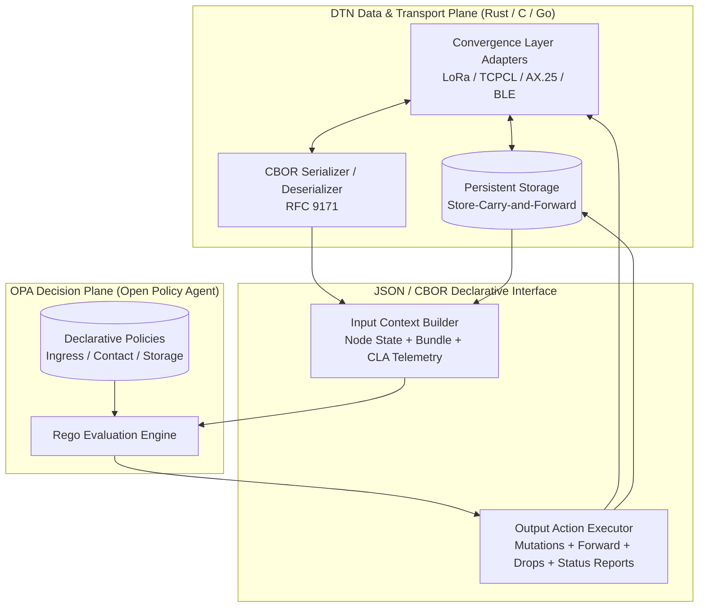
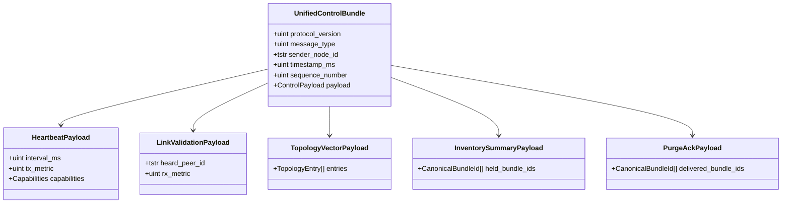
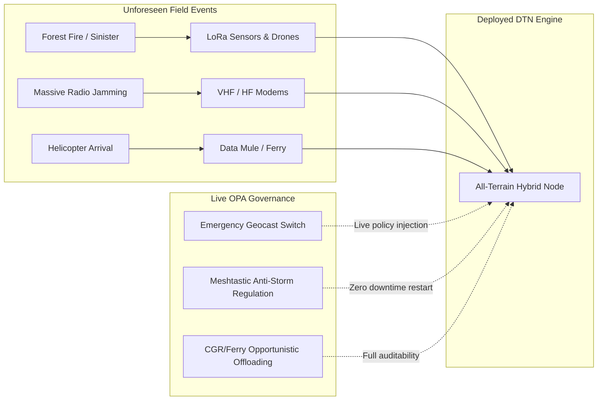

# Article 9 — Architectural Synthesis: Policy-Driven DTN Routing with OPA, Modular Extension Block, and Control Plane Unification

> **CDDL Specifications:** [mesh-algo-extension-block.cddl](./mesh-algo-extension-block.cddl), [prophet.cddl](./prophet.cddl), [maxprop.cddl](./maxprop.cddl), [reticulum.cddl](./reticulum.cddl), [babel.cddl](./babel.cddl), [cgr.cddl](./cgr.cddl)  
> **Policy Code:** [policies/](./policies/) (140 validated OPA unit tests)

> ℹ️ **Editorial Transparency Note (EU AI Act Alignment):** This article was generated with AI assistance under the editorial direction and structuring of a human author, who assumes responsibility for its technical review, verification, and content (ongoing proofreading).

---

## 1. Introduction: The Convergence of Routing Paradigms

Throughout the first eight installments of this series, we explored a spectacular range of routing algorithms, spanning from amateur radio protocols born in the 1980s (APRS AX.25) to modern resilient architectures (Reticulum, Meshtastic) and interplanetary Internet standards (Contact Graph Routing - CCSDS 734.3-B-1 / SABR).

Each of these algorithms was originally designed in its own isolated ecosystem, with its proprietary binary frame formats, ad-hoc metrics, and specific hardware assumptions.

In this project, we pursued a dual ambition:
1. **Demonstrate the universality of Bundle Protocol version 7 ([RFC 9171](https://www.rfc-editor.org/rfc/rfc9171.html))** as a common metamodel capable of encapsulating and unifying any routing semantics.
2. **Completely decouple arbitration logic from the transport engine** using the **Rego** declarative language and the **Open Policy Agent (OPA)** policy engine.

This concluding article provides the architectural synthesis of our work, delves deeper into the design of the Type 200 modular block ([`mesh-algo-extension-block.cddl`](./mesh-algo-extension-block.cddl)), analyzes the potential reconciliation of control messages, identifies the native functions indispensable to the Rego engine, and examines the scope of this approach for field operations, research, and alignment with ongoing standardization work at the IETF.

---

## 2. The OPA / DTN Engine Decoupling and the Type 200 Modular Block

### 2.1. The Complete Decoupling Architecture

The traditional architecture of DTN daemons (such as ION, IBR-DTN, μPCN, or dtn7-rs) typically integrates routing logic in the form of modules compiled in C, C++, or Rust. This rigidity mandates service recompilation or restarts for every algorithmic adjustment, and makes dynamic protocol hybridization on a single node nearly impossible.

Our approach strictly separates the system into two orthogonal planes:



1. **The Host DTN Engine** manages low-level, high-performance tasks: listening on physical interfaces (LoRa modems, AX.25 TNCs, TCP/UDP sockets), RFC 9171-compliant CBOR serialization, persistence on flash memory/NVRAM, and clock management.
2. **The OPA Engine** receives a structured projection (`input`) during three key lifecycle events:
   - **`ingress`:** Decision to accept, immediately drop, or locally deliver upon receiving a bundle.
   - **`contact`:** Decision regarding forwarding opportunity, replication eligibility, and calculation of mutations upon detecting a CLA neighbor.
   - **`storage`:** Decision regarding scheduling, retention, relative age refresh, and preventive eviction facing buffer saturation.

### 2.2. The Type 200 Modular Block: Orthogonal Primitives

Instead of designing a distinct BPv7 extension block for each protocol, we formalized in [**`mesh-algo-extension-block.cddl`**](./mesh-algo-extension-block.cddl) a generic extension block (**Type 200**, reserved in the IANA experimental range `192–255`) structured around orthogonal facets:

```cddl
mesh-routing-data = {
    ? 1 => legacy-bridge-id: (bytes / uint), ; External footprint (LoRa/AX.25 gateway)
    ? 2 => replication-control,              ; Spray & Wait, HYMAD quotas
    ? 3 => trajectory-control,               ; Ordered hops, APRS WIDE n-N, Source Route
    ? 4 => opportunistic-threshold: float,   ; Opportunistic utility threshold (PRoPHET)
    ? 5 => spatial-scope,                    ; Geocasting spatial perimeter (GeoDTN)
    ? 6 => custom-attributes: { * (uint / tstr) => any }
}
```

This block provides unprecedented flexibility:
- An **APRS** packet activates facet 3 (`trajectory-control`) to decrement its `WIDE n-N` aliases.
- A **Spray & Wait** packet activates facet 2 (`replication-control`) to manage the binary division of its quota $L$.
- A **GeoDTN** packet activates facet 5 (`spatial_scope`) to delimit the boundary of its geocasting.
- Two protocols can even compose these facets: a quota-distributed geocast packet will combine `spatial_scope` and `replication_control` in the same block!

### 2.3. Major Finding: Zero Wire Block for Advanced Protocols

One of the most striking insights from our experiments is summarized in this table:

| Protocol Studied | Wire Extension Block on the Cable for Data | Technical Rationale |
| :--- | :--- | :--- |
| **APRS Digipeating** | **Type 200 Block** (`trajectory_control`) | Required to mutate aliases (`WIDE1-1 -> WIDE1*`) in flight. |
| **Spray & Wait** | **Type 200 Block** (`replication_control`) | Required to split copy quotas $L \leftarrow \lfloor L/2 \rfloor$. |
| **GeoDTN Geocast** | **Type 200 Block** (`spatial_scope`) | Required to define center and radius of the target zone. |
| **Meshtastic** | **ZERO proprietary block** (Pure BPv7) | Deduplication by canonical Bundle ID, TTL by standard Hop Count Type 10. |
| **PRoPHET (RFC 6693)** | **ZERO proprietary block** (Pure BPv7) | Only control exchanges $P(a, b)$; data travels standard. |
| **MaxProp / HP-MaxProp**| **ZERO proprietary block** (Pure BPv7) | Buffer sorting calculated locally from standard Hop Count Type 10. |
| **Reticulum (RNS)** | **ZERO proprietary block** (Pure BPv7) | Next hop resolved in local memory from hashed destination EID. |
| **Babel / AREDN** | **ZERO proprietary block** (Pure BPv7) | Pure proactive forwarding or MANET-DTN ferry gateway. |
| **CGR (CCSDS SABR)** | **ZERO proprietary block** (Pure BPv7) | Deterministic contact plan resolved by host node via temporal Dijkstra. |

> [!IMPORTANT]
> **Local telemetry has no place on the radio link.**  
> Signal-to-noise ratio metrics (measured SNR in dB), received signal strength (RSSI in dBm), physical channel backoff delays ($Backoff_{SNR}$), memory occupancy in bytes, and neighbor topology **must never be serialized into data bundles**.  
> They reside exclusively in OPA's evaluation environment (`input.ingress`, `input.contact`, `input.node`), thereby preserving maximum useful bandwidth on constrained links (LoRa, VHF, satellite).

---

## 3. Comparative Analysis and Reconciliation of Control Messages

While data bundles can travel in standard BPv7 format, several of our algorithms require bilateral information exchanges between neighboring nodes during contact opportunities.

By examining our CDDL specifications ([`prophet.cddl`](./prophet.cddl), [`maxprop.cddl`](./maxprop.cddl), [`reticulum.cddl`](./reticulum.cddl), [`babel.cddl`](./babel.cddl), [`cgr.cddl`](./cgr.cddl)), we observe a clear structural redundancy across these protocols.

### 3.1. Comparative Table of Control Primitives

| Control Feature | PRoPHET ([`prophet.cddl`](./prophet.cddl)) | MaxProp ([`maxprop.cddl`](./maxprop.cddl)) | Reticulum ([`reticulum.cddl`](./reticulum.cddl)) | Babel ([`babel.cddl`](./babel.cddl)) | CGR ([`cgr.cddl`](./cgr.cddl)) |
| :--- | :--- | :--- | :--- | :--- | :--- |
| **Heartbeat & Discovery** | `msg-hello` (parameters $\beta, \gamma$, sender EID) | Implicit via `msg-prob-vector` or CLA beacon | `msg-announce` (public key, hops, random salt) | `msg-hello` (seqno, interval ms, TX cost) + `msg-ihu` | Implicit via schedule or `msg-contact-plan-update` |
| **Bidirectional Link Confirmation** | Implicit by CLA session | Implicit by CLA session | Cryptographic proof (`msg-proof`) | **Explicit: `msg-ihu`** (*I Heard You*) with RX cost | Scheduled bidirectional contact |
| **Topological State / Routing Vector** | `msg-rib-update` (list of $P(sender, dest)$) | `msg-prob-vector` (EID map $\to$ probabilities $P$) | `msg-announce` (destination hash, next-hop) | `msg-update` (prefix, seqno, metric, router-id) | `msg-contact-plan-update` (intervals, data rates, OWLT) |
| **Inventory of Stored Bundles** | `msg-summary-vector` (list of Bundle IDs) | Merged in handshake | None (unicast routing without duplication) | None (MANET routing without persistent buffer) | Resolved locally by volume tracking |
| **Distributed Buffer Cleanup** | `msg-delivery-ack` (list of delivered bundles) | **`msg-cleared-list`** (list of delivered Bundle IDs) | End-to-end delivery acknowledgment (`msg-proof`) | Non-existent (routing without delay-tolerant storage) | Automatic eviction at window expiration |

### 3.2. Reconciliation Proposal: A Generic Signaling Protocol

Given this functional convergence, we can design a **Unified DTN-Mesh Control Grammar** that reconciles all these needs within a standardized CBOR frame:



#### CDDL Modeling of a Unified Control Plane

```cddl
unified-mesh-control = {
    1 => version: 1,
    2 => message-type: &(
        type-heartbeat: 1,      ; 1-way discovery & heartbeat
        type-link-confirm: 2,   ; 2-way validation (IHU / RTT)
        type-topology-vector: 3,; Routing vector (Probabilities, Metrics, or Contacts)
        type-inventory-summary: 4, ; Summary Vector of held bundles
        type-purge-ack: 5       ; Distributed Cleared List / Delivery ACKs
    ),
    3 => sender-id: (tstr / bytes .size 16), ; EID URI or Reticulum Hash
    4 => timestamp-ms: uint,
    5 => seqno: uint,
    6 => payload: (
        unified-heartbeat /
        unified-link-confirm /
        unified-topology-vector /
        unified-inventory /
        unified-purge-ack
    )
}

unified-heartbeat = {
    1 => interval-ms: uint,
    ? 2 => tx-cost: uint,
    ? 3 => capabilities: [* tstr] ; Ex: ["prophet", "maxprop", "cgr", "ferry"]
}

unified-link-confirm = {
    1 => peer-id: (tstr / bytes .size 16),
    2 => rx-cost: uint,
    ? 3 => measured-snr-db: float
}

unified-topology-vector = {
    1 => metric-type: &(probabilistic: 1, distance-vector: 2, contact-plan: 3),
    2 => entries: [ * {
        1 => target: (tstr / bytes .size 16),
        2 => metric-value: float, ; Probability [0-1] or Bellman-Ford Cost
        ? 3 => seqno: uint,       ; Babel-style loop avoidance
        ? 4 => valid-until: uint  ; Temporal validity window
    }]
}

unified-inventory = {
    1 => held-bundles: [* canonical-bundle-id]
}

unified-purge-ack = {
    1 => cleared-bundles: [* canonical-bundle-id]
}

canonical-bundle-id = [
    source: (tstr / bytes .size 16),
    creation-time: uint,
    sequence-number: uint
]
```

Such reconciliation provides a major advantage: **a single CBOR parser and a single link signaling state machine** suffice to feed any underlying algorithm.

---

## 4. Required Native Functions in the OPA Evaluation Environment (Custom Builtins)

The **Open Policy Agent (OPA)** policy engine was originally designed to evaluate HTTP authorization requests, Kubernetes objects, or cloud infrastructure IAM rules. Its Rego engine intentionally lacks traditional imperative loops and favors set comprehensions.

In our DTN modeling, the majority of simple arithmetic calculations (predictability multiplication, quota decrements, scalar comparisons) are expressed perfectly in pure Rego. However, deploying this architecture at scale on actual hardware requires that **certain operations cannot be modeled as static JSON data** and mandate native functions implemented directly by the execution host (in C, Rust, or Go) as OPA Custom Builtins.

### 4.1. Asymmetric Cryptography and High-Performance Hashing

| Proposed Builtin Function | Role and Algorithmic Necessity | Target Protocol |
| :--- | :--- | :--- |
| `crypto.ed25519.verify(pubkey, message, signature)` | Mathematical verification of a path announcement signature. Impossible to perform securely and efficiently in pure Rego. | **Reticulum** ([`reticulum.rego`](./policies/reticulum/ingress.rego)), **BPSec (RFC 9172)** |
| `crypto.sha256_truncated(data, 16)` | Calculation of a 128-bit cryptographic hash for a destination or packet. Required to validate address authenticity without plain text. | **Reticulum**, **Meshtastic packet ID** |
| `crypto.constant_time_compare(a, b)` | Comparison of cryptographic digests protected against side-channel timing attacks. | Global Ingress Security |

### 4.2. Graph Algorithms and Operational Research

For small topology sizes (fewer than 10 nodes), set traversal in Rego is feasible. Beyond that, the complexity limits of the rule engine become apparent:

| Proposed Builtin Function | Signature & Role | Target Protocols |
| :--- | :--- | :--- |
| `graph.dijkstra_time_expanded(contacts, ranges, source, dest, now)` | Executes future-oriented time-expanded Dijkstra, incorporating one-way propagation delay ($OWLT$) and window capacity. Returns the hop sequence and *Earliest Delivery Time* ($EDT$). | **CGR / SABR (CCSDS 734.3-B-1)** ([`cgr.rego`](./policies/cgr/contact.rego)) |
| `graph.dijkstra_log_cost(prob_matrix, source, dest, epsilon)` | Calculates the probabilistic shortest path by applying the information metric $-\log(P + \epsilon)$ and returning total path cost $C$. | **MaxProp & HP-MaxProp** ([`maxprop.rego`](./policies/maxprop/contact.rego)) |

> [!NOTE]
> **Why delegate graph traversal to a host builtin?**  
> In pure Rego, recursive graph traversal requires set constructs with expensive joins ($O(V^3)$ in the worst case).  
> A compiled builtin in Rust or C utilizing a min-heap priority queue solves the problem in $O(E + V \log V)$, bringing execution time down below 50 microseconds, even on an ARM Cortex-M4 microcontroller or ESP32.

### 4.3. Spherical Geometry and Geodesy

In our preliminary tests in [Article 8](./article-8-geodtn.en.md), we used a simplified planar Euclidean distance ($\sqrt{\Delta x^2 + \Delta y^2}$). On terrestrial terrain, this approximation becomes inaccurate as distance increases:

| Proposed Builtin Function | Mathematical Role | Target Protocol |
| :--- | :--- | :--- |
| `geo.haversine_distance(lat1, lon1, lat2, lon2)` | Calculates true great-circle distance on the Earth's surface taking into account spherical curvature ($R = 6371\text{ km}$). | **GeoDTN & Geocasting** ([`geodtn.rego`](./policies/geodtn/contact.rego)) |
| `geo.point_in_polygon(lat, lon, polygon_coordinates)` | Verifies inclusion of a beacon or node inside a non-circular geographic area (e.g., polygonal disaster area). | **Emergency Geocasting (SAR)** |

### 4.4. Transcendent and Floating-Point Mathematics

Rego supports basic arithmetic operations, but lacks standard transcendent functions in its default runtime:
- `math.ln(x)` and `math.log10(x)`: MaxProp logarithmic cost $-\log(P + \epsilon)$.
- `math.exp(x)`: Continuous temporal decay of PRoPHET aging:
  $$P_{(A, B)} \leftarrow P_{(A, B)} \times e^{-\alpha \cdot \Delta t}$$
- `math.sin(x)`, `math.cos(x)`, `math.atan2(y, x)`: Geodesic calculations and directional antenna bearings.

---

## 5. Operational Benefits: From Tactical Field to Research Laboratories

The strict separation between the DTN transport engine and declarative decision logic radically transforms two often disconnected worlds: operational deployments in hostile environments and academic scientific research.

### 5.1. On the Ground: Tactical Networks, Emergency Rescue, and Citizen Resilience



1. **Live Dynamic Reconfiguration (Zero Downtime):**  
   In an emergency rescue operation, a node initially configured as a high-bandwidth Babel/AREDN repeater may lose its Wi-Fi links following a power failure. The operator can inject a new declarative policy over the air to instantly switch it into a Spray & Wait opportunistic relay or GeoDTN node, **without recompiling firmware, without restarting processes, and without risking corruption of stored data**.
2. **Native Protection Against Denial of Service and Spam:**  
   Dynamic rule injection in `blacklist_sources` (introduced in [Article 0](./article-0-intro.en.md)) allows immediate containment of malicious or failing equipment saturating shared LoRa bandwidth.
3. **Auditability and Operational Traceability:**  
   Every decision made by OPA is accompanied by a full explanatory trace (`decision.reason`). Communications officers or emergency coordinators have an unalterable log showing exactly why a critical packet was forwarded, held, or evicted from the storage buffer.

### 5.2. For Research: Integration into Simulators and Hardy

The historical gap between research in opportunistic networks and real deployments has always been a major hurdle. Researchers write algorithms in Java in **The ONE Simulator** or C++ in **ns-3**, while system engineers develop completely different architectures in C or Rust.

Our unified architecture bridges this gap permanently:

1. **Integration into The ONE or ns-3 Simulators:**  
   By embedding a Rego evaluation engine (via WebAssembly bindings or C FFI) into the simulator, the exact same policy files ([`policies/prophet/`](./policies/prophet/), [`policies/maxprop/`](./policies/maxprop/), [`policies/geodtn/`](./policies/geodtn/)) can be executed directly in academic simulation across thousands of virtual nodes. Measured delivery metrics in simulation faithfully mirror production code behavior.
2. **Integration into the Hardy Reference Implementation (Rust):**  
   **Hardy** is a modern, high-speed, secure implementation of Bundle Protocol v7 written in Rust. By compiling our OPA policies into **WebAssembly artifacts (`opa build -t wasm`)**, Hardy can load the Wasm virtual machine directly into its async Tokio pipeline:
   - Ingress policy evaluation time: **$< 10\ \mu s$**.
   - Total memory isolation (sandboxing): a corrupted policy cannot crash the transport daemon.
   - Cross-platform compatibility: the exact same Wasm binary runs on a Linux x86_64 server, a Raspberry Pi gateway, or a hardened embedded system.

---

## 6. Alignment with IETF Drafts and Recognized Extensions

Our work on the experimental Type 200 block and OPA routing policies directly aligns with active discussions in the **IETF DTN (Delay-Tolerant Networking Working Group)** and the **IRTF**.

### 6.1. NASA / ION's SNW (Spray and Wait) Block

The reference implementation **ION (Interplanetary Overlay Network)** maintained by JPL / NASA features an experimental extension dedicated to the Spray and Wait algorithm:
- In ION, this extension occupies a private code in the unassigned IANA experimental range and encapsulates a simple integer representing remaining copies ($L$).
- **Comparison with our approach:** Our `replication_control` facet (defined in [`mesh-algo-extension-block.cddl`](./mesh-algo-extension-block.cddl#L34-L39)) generalizes NASA's approach:
  - It supports both source mode (unit decrement $L \leftarrow L - 1$) and optimized binary mode ($L \leftarrow \lfloor L/2 \rfloor$).
  - It formalizes explicit state transitions between dissemination phase (`phase-disseminate: 1`) and direct waiting phase (`phase-wait: 2`).
  - It incorporates a generation counter (`generation: uint`) essential for auditing replication trees during prolonged network partitioning.

### 6.2. `draft-ietf-dtn-bp-sand` (Secure Advertisement and Neighborhood Discovery)

The active draft **`draft-ietf-dtn-bp-sand`** represents a major advancement at the IETF: it formalizes a standardized protocol for exchanging neighborhood metrics and topological discovery for the BPv7 control plane.

There is a near one-to-one correspondence between `bp-sand` objectives and our architecture:
- `bp-sand` standardizes bilateral exchanges of physical metrics (link quality, available bandwidth, 1-hop neighborhood).
- In our model, these exact metrics constitute the raw material injected into OPA's `input.contact` and `input.neighbors` objects!
- The proposed control reconciliation in Section 3 ([`unified-mesh-control`](#cddl-modeling-of-a-unified-control-plane)) provides a compact, CBOR-encoded implementation fully aligned with `bp-sand` principles.

### 6.3. `draft-burleigh-dtn-ecos` (Extended Class of Service)

Authored by Scott Burleigh (one of DTN's pioneers), **`draft-burleigh-dtn-ecos`** proposes extending BPv7 Primary Block Quality of Service (QoS) semantics. It introduces parameters for preferential forwarding, critical urgency, and storage retention priority.

Throughout our series, we demonstrated how these requirements are governed:
- In [Article 4 (MaxProp)](./article-4-maxprop.en.md), the storage eviction queue is no longer a destructive FIFO: it sorts bundles based on the sum of their theoretical information cost and QoS priority.
- ECOS attributes (`criticality`, `flow-label`, `ordinal`) naturally inject into the Primary Block or `custom-attributes` of our Type 200 block, enabling Rego storage policies ([`policies/storage.rego`](./policies/storage.rego)) to evict non-urgent telemetry before touching vital distress messages.

### 6.4. BPQ (Bundle Protocol Query Extension Block - IRTF)

Emerging from foundational DTNRG work (**`draft-irtf-dtnrg-bpq`**, by S. Farrell, A. Lynch, D. Kutscher, and A. Lindgren), the **BPQ** extension block defines a standard mechanism enabling intermediate nodes to query peer storage for bundle presence or synchronize data collections without redundant transmission.

Our work operationalizes and extends this concept:
- **Summary Vectors** formalized in [`prophet.cddl`](./prophet.cddl) and [`maxprop.cddl`](./maxprop.cddl) achieve this query mechanism by comparing canonical identifiers `(source, time, seq)`.
- **Cleared Lists** complement BPQ by propagating destruction acknowledgments to collectively purge network storage buffers.

---

## 7. General Series Overview

To conclude this architectural journey, here is the master summary matrix linking all 9 articles, their theoretical foundations, wire structures, and OPA declarative rules:

| Article & Protocol | Key Paradigm | Addressing Format | Type 200 Block Role | Control Signaling | OPA Tests |
| :--- | :--- | :--- | :--- | :--- | :--- |
| **[Art. 0 — Foundations](./article-0-intro.en.md)** | BPv7 Standard & OPA | EID RFC 9171 | Architectural foundation | Standard BPv7 Status Reports | 14/14 |
| **[Art. 1 — APRS AX.25](./article-1-aprs.en.md)** | Source routing & alias | Radio Callsigns | `trajectory_control` | None (blind broadcast) | 13/13 |
| **[Art. 2 — Spray & Wait & Meshtastic](./article-2-flood.en.md)** | Quotas & SNR Contention | EID / NodeNum | `replication_control` / Zero block | Local physical contention | 17/17 |
| **[Art. 3 — PRoPHET](./article-3-prophet.en.md)** | Probabilistic opportunistic | Canonical EID | Optional (`opportunistic_threshold`) | Handshake RIB & SV ([`prophet.cddl`](./prophet.cddl)) | 16/16 |
| **[Art. 4 — MaxProp & HP-MaxProp](./article-4-maxprop.en.md)** | Log cost & Buffer Sorting | Canonical EID | ZERO data wire block | Prob-Vector & Cleared List ([`maxprop.cddl`](./maxprop.cddl)) | 16/16 |
| **[Art. 5 — Reticulum](./article-5-reticulum.en.md)** | Reactive distance vector | 16-byte hash | ZERO data wire block | Signed Announces ([`reticulum.cddl`](./reticulum.cddl)) | 16/16 |
| **[Art. 6 — Babel / AREDN / HYMAD](./article-6-babel-aredn.en.md)** | Loop-free proactive & Ferry | EID / Subnet | ZERO data wire block | Hellos, IHU, Updates ([`babel.cddl`](./babel.cddl)) | 16/16 |
| **[Art. 7 — CGR (CCSDS SABR)](./article-7-cgr.en.md)** | Spatial deterministic | Interplanetary EID | ZERO data wire block | Contact Plan Updates ([`cgr.cddl`](./cgr.cddl)) | 16/16 |
| **[Art. 8 — GeoDTN & Geocast](./article-8-geodtn.en.md)** | Geographic Greedy & SCF | GPS Coordinates | `spatial_scope` | Zero signaling required | 16/16 |
| **[Art. 9 — Synthesis](./article-9-synthese-architecture.en.md)** | **Unified OPA Architecture** | **Multi-addressing** | **Modular Type 200** | **Reconciled Control Grammar** | **140/140** |

---

## 8. Conclusion: Towards a Declarative Delay-Tolerant Internet

The combination of **Bundle Protocol version 7** and a declarative policy engine like **Open Policy Agent** brings a decisive answer to the historical challenges of constrained and opportunistic networks.

By permanently separating binary plumbing (CBOR, modems, radio interfaces, physical storage) from forwarding intelligence, we transformed the DTN router into an **agnostic, highly reconfigurable expert system**. Whether saving lives during an earthquake, connecting remote LoRa communities, securing tactical communications under jamming, or orchestrating probe constellations around Mars, decision rules are written with the same declarative clarity.

The CDDL specifications, Rego rules, and automated test suite provided in this repository offer a rigorous, open, and ready-to-use foundation for next-generation reference implementations.

---

👉 **Continue Reading:**  
[Article 10 — Perspectives and Extension Roadmap: Towards a Panoramic View of DTN Routing and Control Plane Evolution](./article-10-roadmap-extensions.en.md)

🏁 Explore the full source code, CDDL specifications, and declarative policies in the [DTN Mesh Algorithm Project Repository](./index.en.md).
